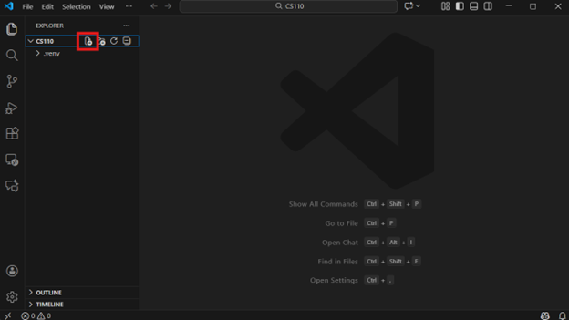
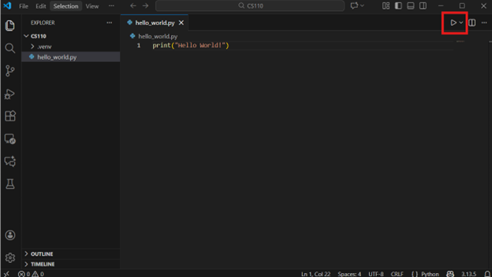
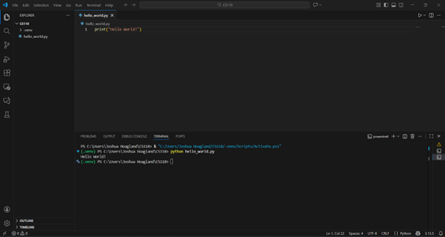

# 📘 CS 110 — Python Development Environment Setup  
*A beginner-friendly guide to getting your tools ready for programming.*

---

## 🌟 Introduction

Welcome to **CS 110**! In this class, you'll begin your journey into programming using **Python**, one of the world’s most widely used languages. This document will provide a step-by-step guide through the basics of Python development, including installing software, navigating the terminal, creating virtual environments, and installing dependencies.

Before writing your first program, you’ll need to set up your computer with:

- **Python** (the programming language)
- **Visual Studio Code (VS Code)** (your editor)
- **The terminal** (your command-line workspace)
- **Virtual environments** (project-specific “bubbles” for Python)
- **Dependencies** (extra tools Python needs)

Each section below will walk you through installation, setup, and basic usage.  

A **coding environment** is the collection of tools and settings that allow you to write software. Just like a carpenter needs the right workspace, saw, and measuring tools, a programmer needs the right software and setup to work effectively. In CS 110, you will use Python and Visual Studio Code (VS Code) as the main tools for writing and running your code. Python is the programming language you will be typing in, and VS Code is the application where you will write and manage your files.

Throughout the class, you will also use the **terminal**, which is a text-based interface for giving instructions directly to the computer. While terminals may look intimidating at first, they are powerful, efficient and commonly used by programmers at all levels. We’ve provided a small set of commands that will allow you to move between folders, open files, check your environment, and run Python programs. These commands are the same whether you are on Windows, macOS, or Linux, so learning them now will be valuable.

After you have installed the necessary software, we will teach you how to set up a **virtual environment**. A virtual environment is a lightweight “bubble” that keeps each project separated from others. Every Python project you work on should have its own environment with its own versions of tools and libraries. This prevents projects from interfering with one another and helps keep your work organized, stable, and easy to reproduce. In professional software development, virtual environments are a standard practice, and you’ll be using them throughout CS 110. 

We will then show you how to install several dependencies. **Dependencies** are additional pieces of software that your programs need in order to run. Some of these are libraries created specifically for creating charts and scientific computing. For example, we will install numpy, one of the most common libraries for working with numbers and data. You will also install supporting libraries like byu_pytest_utils and byubit, which will help with testing and running assignments throughout the semester. Installing dependencies ensures that your program has all the parts it needs to function properly.

By the end of these instructions, you will have a fully working Python development environment, the ability to navigate the terminal, and the tools needed to begin writing and running programs confidently. Don’t worry if everything feels new, this class is designed for beginners, and every programmer once stood exactly where you are now. With a little practice, these tools will soon feel natural, and you’ll be ready to focus on solving real world problems and building new things with code. Welcome to CS 110, and let’s get started!

---

# Materials Needed
- [ ] Computer 
  - [ ] Windows 10/11
  - [ ] MacOS
- [ ] Access to Internet 

# Table of Contents
1. [Installing Python](#python)
2. [Installing VS Code](#vscode)
3. [Navigating the Terminal](#third-example)
4. [Creating a Virtual Environment](#venv)
5. [Downloading Dependencies](#dependencies)
6. [Running a Python File](#running)


---

# 🐍 Installing Python <a name="python"></a>

### 1. Download Python  
Visit the official download page:  
https://www.python.org/downloads

Choose the installer that matches your operating system.

### 2. Download the latest version  


### 3. Open the installer  
Follow the instructions based on your OS:

---

### **Windows**
📌 **IMPORTANT:** Check the box: **“Add Python to PATH.”**

Then choose **Install Now**.


---

### **MacOS**
Just open the installer and walk through the prompts. No extra steps needed.  


---

### 4. Verify the Installation

#### **Windows**
1. Open **Windows PowerShell**
2. Run:
   ```bash
   python --version
   ```
3. You should see something like:  
   

---

#### **MacOS**
1. Open **Terminal** (via Spotlight search)
2. Run:
   ```bash
   python3 --version
   ```
3. You should see something like:  
   

---

# 💻 Installing Visual Studio Code (VS Code) <a name="vscode"></a>

### 1. Download VS Code  
https://code.visualstudio.com/download

Choose the installer that matches your OS.  


---

### **Windows Installation**
1. Accept the license agreement
 


1. Accept or change the destination folder  
2. Check these boxes:
   - **Add ‘Open with Code’ action**
   - **Add to PATH**
  


4.. Click **Install**.

---

### **MacOS Installation**
Just open the installer—VS Code will set itself up automatically.  


---

### 2. Install the Python Extension
1. Open VS Code  
2. Go to the **Extensions** tab (left sidebar)  
3. Search for **Python**  

1. Install the official extension by Microsoft  

---

# 🖥️ Navigating the Terminal <a name="terminal"></a>

You can open a terminal in VS Code:

- **Windows/Linux:** `CTRL + \`` `
- **MacOS:** `CMD + \``  
Or go to: **Terminal > New Terminal**


You can also open your system terminal:

- **Windows:** Search for *PowerShell*  
- **MacOS:** Search for *Terminal*


## 📂 Common Terminal Commands

| Command | Description |
|--------|-------------|
| `pwd` | Print working directory (current folder path) |
| `ls` | List files/folders in directory |
| `cd ..` | Move to parent directory |
| `cd path/to/folder` | Move to specific folder |
| `cd ~` | Go to home directory |
| `code folder` | Open folder/file in VS Code |
| `python file.py` | Run a Python file |
| `mkdir name` | Create a new folder |

---

# 📦 Creating a Virtual Environment <a name="venv"></a>

A **virtual environment** is a way that python is able to create isolated “projects” or environments that are able to run different tools and libraries. This lets you manage dependencies and various python extensions for different projects independently. Virtual environments ensure that projects are independent of one another and ensure stable, reproducible environments. 

> **NOTE**: Every CS 110 project should use its own environment.

### 1. Open the Command Palette
- **Windows:** `CTRL + SHIFT + P`  
- **MacOS:** `CMD + SHIFT + P`

### 2. Search for:  
**Python: Create Environment**


### 3. Choose Environment Manager
Select: **venv**

### 4. Choose Interpreter  
Pick the **latest version of Python**.

### 5. Name the Environment  
We recommend leaving it as:  
```
.venv
```

### 6. Skip package installation  
(You’ll install packages manually later.)

### 7. You should see a `.venv` folder appear  


---

## 🔌 Activating the Virtual Environment

### **Windows PowerShell**
```bash
.\.venv\Scripts\Activate.ps1
```

### **MacOS / Linux**
```bash
source ./.venv/bin/activate
```

You should now see:
```
(.venv)
```
on the left side of your terminal prompt.

🎉 Congratulations! your virtual environment is ready!

---

# 📥 Installing Dependencies & Libraries <a name="dependencies"></a>

A **dependency** is something that your program needs in order to work, but that doesn’t come built in. For example, if your program needs to make charts, download data, or do something else special, you may need to install an extra tool (called a library or package) that provides that ability. Installing dependencies makes sure your program has all the parts it needs to run successfully.

For CS 110, you’ll need:

- `byu_pytest_utils`
- `numpy`
- `byubit`

### 1. Make sure your environment is active  
(You should see `(.venv)` in the terminal.)

### 2. Install packages:

```bash
pip install byu_pytest_utils
pip install numpy
pip install byubit
```

Each installation should look similar to:  


---

# 🏁 Running a Python File <a name="running"></a>

### 1. Open a new window in VS Code
Select **"Open Folder"** from the start options.

Find and Open your **CS110** folder.

### 2. Create a File
Hover over the CS110 Folder on the left. Four icons will appear. 

Click on the icon that looks like a sheet of paper with a “+”. It should look like this:


### 3. Name Your New File
Name your file: `hello_world.py`

📌 **IMPORTANT:** the **.py** in the file name is how your computer will recognize this as a python file

## ✏️ Editing the File

> **Note**: You can now write anything in this file. There is important syntax that we will teach you as a part of this class but for now just follow these instructions.

Add this line to the file:
```python
print("Hello World!")
```


## ▶️ Running the File
> **Note**: There are two ways to run the file, choose whichever you like

### Option 1. 
Select the play button on the top right



### Option 2. 
1. Open the terminal by selecting “terminal” from the options in the top left and “new terminal” from the drop down menu.
2. This will open up a terminal in the CS110 directory.
> **Note**: If you do not see “CS110” at the end of the file path then you are in the wrong place. Change your directory with the commands in the table until you’re in the CS110 directory.
3. type `python hello_world.py` into the terminal and press enter like this:



4. Congratulations! You’ve run your first python file! Everything is set up and you are now ready for class!

# ✅ You're Ready!

Your computer is now fully set up for CS 110:
- Python installed  
- VS Code configured  
- Terminal basics learned  
- Virtual environment created  
- Dependencies installed  
- Running Python Files

You’re ready to start coding! 🚀
